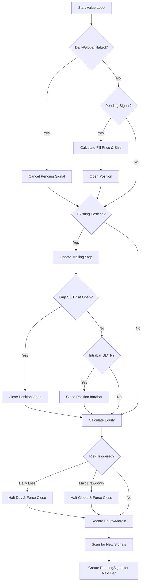

# 📖 marginbt — Complete Usage Guide

> **marginbt** is a Python backtesting engine for margin accounts.  
> Designed for precise leveraged execution simulation with built-in risk controls.

---

## Table of Contents

1. [Installation](#1-installation)
2. [Core Concepts](#2-core-concepts)
3. [Quick Start — Up and Running in 5 Minutes](#3-quick-start--up-and-running-in-5-minutes)
4. [API Reference — BacktestEngine](#4-api-reference--backtestengine)
5. [API Reference — Portfolio.from_signals()](#5-api-reference--portfoliofrom_signals)
6. [BacktestResult — Reading Results](#6-backtestresult--reading-results)
7. [Position Sizing](#7-position-sizing)
8. [Stop-Loss & Take-Profit](#8-stop-loss--take-profit)
9. [Trailing Stop-Loss](#9-trailing-stop-loss)
10. [Risk Controls — Circuit Breaker & Kill Switch](#10-risk-controls--circuit-breaker--kill-switch)
11. [Margin & Liquidation](#11-margin--liquidation)
12. [Short Selling](#12-short-selling)
13. [Gap & Conflict Policies](#13-gap--conflict-policies)
14. [Execution Metadata (exec_meta)](#14-execution-metadata-exec_meta)
15. [Testing & Regression Snapshot](#15-testing--regression-snapshot)
16. [Internal Architecture](#16-internal-architecture)
17. [Full Examples](#17-full-examples)

---

## 1. Installation

```bash
# Clone the repository
git clone https://github.com/yourusername/marginbt.git
cd marginbt

# Install dependencies
pip install -r requirements.txt

# Install the package in editable mode (recommended for development)
pip install -e .
```

**Dependencies:**
- Python ≥ 3.10
- pandas ≥ 2.0
- numpy ≥ 1.24

After installation, simply import:

```python
import marginbt as mbt
```

---

## 2. Core Concepts

### What does marginbt do?

marginbt takes **entry/exit signals** (boolean Series) and **OHLC price data**, then simulates trades bar-by-bar with these specialized features:

```
Signals (entries/exits) + Price Data (OHLC) → BacktestEngine → BacktestResult
```

### How it differs from VectorBT

| Feature | VectorBT | marginbt |
|---|---|---|
| Leverage / Margin | ❌ Not supported | ✅ Full support |
| Daily Loss Limit | ❌ | ✅ Circuit Breaker |
| Global Kill Switch | ❌ | ✅ Drawdown Halt |
| Liquidation Simulation | ❌ | ✅ Maintenance Margin |
| Same-bar SL/TP Conflict | Picks first | ✅ Risk-first Policy |
| Gap-aware SL | ❌ | ✅ Fill at bar open |
| API Style | `from_signals` | ✅ Same (`from_signals`) |

### Execution Flow (per-bar processing order)



> **Important:** A signal at bar `i` is filled at bar `i+1` (T+1 execution) to prevent look-ahead bias.

---

## 3. Quick Start — Up and Running in 5 Minutes

### Example 1: Basic Long-only

```python
import marginbt as mbt
import pandas as pd
import numpy as np

# Create sample price data
idx = pd.date_range("2025-01-01", periods=100, freq="1h")
np.random.seed(42)
price = pd.Series(100 + np.cumsum(np.random.randn(100) * 0.5), index=idx)

# Generate entry/exit signals
entries = price < price.rolling(20).mean()  # Buy when price < SMA20
exits   = price > price.rolling(20).mean()  # Sell when price > SMA20

# Create engine and run
engine = mbt.BacktestEngine(
    init_cash=10_000,    # Starting capital: 10,000 USDT
    fees=0.00045,        # Fee rate: 0.045% per side
)

result = engine.run(
    close=price,
    entries=entries,
    exits=exits,
    sl_stop=0.02,        # 2% stop-loss
)

# View results
print(result.stats())
print(result.trades)
print(result.equity_curve)
```

### Example 2: VBT-style API

```python
result = mbt.Portfolio.from_signals(
    price,
    entries=entries,
    exits=exits,
    sl_stop=0.02,
    engine=mbt.BacktestEngine(init_cash=10_000),
)
print(result.stats())
```

---

## 4. API Reference — BacktestEngine

### Creating an Engine

```python
engine = mbt.BacktestEngine(
    init_cash=10_000.0,                  # Starting capital (USDT)
    fees=0.00045,                        # Fee per side (0.045%)
    slippage=0.0002,                     # Adverse slippage (0.02%)
    freq="1h",                           # Timeframe label (display only)
    leverage=1.0,                        # No leverage (default)
    maintenance_margin_rate=0.005,       # Maintenance margin rate
    liquidation_fee_rate=0.0,            # Liquidation fee
    daily_loss_limit_pct=1.0,            # Disabled by default (set to 0.015 for 1.5%)
    kill_switch_drawdown_pct=1.0,        # Disabled by default (set to 0.015 for 1.5%)
    risk_free_annual=0.03,               # Risk-free rate for Sharpe (3%)
    year_days=365,                       # Days per year (crypto=365)
    gap_sl_policy="bar_open",            # Gap SL fill policy
    same_bar_conflict_policy="risk_first",  # SL/TP conflict resolution
)
```

### `__init__` Parameters

| Parameter | Type | Default | Description |
|---|---|---|---|
| `init_cash` | float | 10,000.0 | Starting capital in USDT |
| `fees` | float | 0.00045 | Fee rate per side, e.g. 0.00045 = 0.045% |
| `slippage` | float | 0.0002 | Adverse slippage applied on entry and exit |
| `freq` | str | "1h" | Timeframe label (display only, does not affect logic) |
| `leverage` | float | 1.0 | Maximum leverage (1 = no leverage). Caps position size and used for margin calculation |
| `maintenance_margin_rate` | float | 0.005 | Exchange maintenance margin rate for liquidation checks |
| `liquidation_fee_rate` | float | 0.0 | Additional fee charged on liquidation events |
| `daily_loss_limit_pct` | float | 1.0 | Disabled by default. Set to e.g. 0.015 (1.5%) to halt entries after intraday loss |
| `kill_switch_drawdown_pct` | float | 1.0 | Disabled by default. Set to e.g. 0.015 (1.5%) to halt strategy after drawdown |
| `risk_free_annual` | float | 0.03 | Annual risk-free rate for Sharpe Ratio calculation |
| `year_days` | int | 365 | Calendar days per year (crypto=365, stocks=252) |
| `gap_sl_policy` | str | "bar_open" | When price gaps past SL, fill at bar open price |
| `same_bar_conflict_policy` | str | "risk_first" | When SL and TP both trigger on the same bar, treat it as SL (risk protection) |

### Method: `engine.run(...)`

```python
result = engine.run(
    close=close,                         # Close prices (required)
    open=open_series,                    # Open prices (defaults to close)
    high=high_series,                    # High prices (defaults to close)
    low=low_series,                      # Low prices (defaults to close)
    entries=entries,                     # Long entry signals (boolean)
    exits=exits,                         # Long exit signals (boolean)
    short_entries=short_entries,          # Short entry signals (boolean)
    short_exits=short_exits,             # Short exit signals (boolean)
    sl_stop=0.02,                        # Stop-loss as % of entry price
    sl_trail=False,                      # Enable trailing stop?
    tp_stop=0.10,                        # Take-profit as % of entry price
    tp_price=tp_series,                  # TP at a specific price level
    price=custom_price,                  # Custom entry fill price
    stop_entry_price="fillprice",        # Price reference for SL/TP calculation
    size=None,                           # Position size value
    size_type="risk",                    # How size is calculated
    risk_per_trade=0.0025,               # % of equity risked per trade
    direction="longonly",                # Direction: longonly/shortonly/both
    min_qty=0.001,                       # Minimum order qty (exchange constraint)
    enforce_min_constraints=True,        # Enforce min_qty checks?
    skip_if_below_min=True,              # Skip trade if below min_qty?
    instrument="BTCUSDT",               # Instrument label (metadata only)
)
```

### `run()` Parameters

| Parameter | Type | Default | Description |
|---|---|---|---|
| `close` | pd.Series | **required** | Close prices — must have a sorted DatetimeIndex |
| `open` | pd.Series | None | Open prices — falls back to `close` if omitted |
| `high` | pd.Series | None | Bar high prices — falls back to `close` if omitted |
| `low` | pd.Series | None | Bar low prices — falls back to `close` if omitted |
| `entries` | pd.Series[bool] | None | `True` = long entry signal at that bar |
| `exits` | pd.Series[bool] | None | `True` = long exit signal (boolean TP) |
| `short_entries` | pd.Series[bool] | None | `True` = short entry signal |
| `short_exits` | pd.Series[bool] | None | `True` = short exit signal |
| `sl_stop` | float / pd.Series | None | Stop-loss as a fraction of entry price, e.g. `0.02` = 2% |
| `sl_trail` | bool | False | Enable trailing stop — SL ratchets in the favorable direction |
| `tp_stop` | float | None | Take-profit as a fraction of entry price, e.g. `0.20` = 20% (VBT-compatible) |
| `tp_price` | float / pd.Series | None | Take-profit at a specific price level (overrides `exits`) |
| `price` | float / pd.Series | None | Custom entry fill price (default = `close`, matching VBT behavior) |
| `stop_entry_price` | str | "fillprice" | Which price SL/TP percentages are calculated from: `"fillprice"`, `"close"`, `"open"` |
| `size` | float | None | Size value — interpretation depends on `size_type` |
| `size_type` | str | "risk" | How size is interpreted: `"risk"` / `"amount"` / `"value"` / `"percent"` |
| `risk_per_trade` | float | 0.01 | Fraction of equity risked per trade (1%) — only used with `size_type="risk"` |
| `direction` | str | "longonly" | Trading direction: `"longonly"`, `"shortonly"`, or `"both"` |
| `min_qty` | float | None | Minimum order quantity (exchange constraint) |
| `enforce_min_constraints` | bool | False | Whether to enforce `min_qty` / `min_notional` checks |
| `skip_if_below_min` | bool | True | Skip entry if computed qty is below `min_qty` |
| `instrument` | str | None | Instrument label for metadata |

### Method: `engine.describe()`

```python
print(engine.describe())
# Returns a dict of all settings:
# {'init_cash': 1000, 'fees': 0.00045, 'leverage': 10.0, ...}
```

---

## 5. API Reference — Portfolio.from_signals()

`Portfolio.from_signals()` is a **shortcut** with VectorBT-compatible syntax:

```python
result = mbt.Portfolio.from_signals(
    close,                    # Close prices (required)
    entries=entries,          # Long entry signals
    exits=exits,              # Long exit signals
    engine=engine,            # BacktestEngine instance (optional; creates default if omitted)
    # ... all other kwargs are forwarded to engine.run()
    sl_stop=0.02,
    risk_per_trade=0.01,
)
```

These two are equivalent:

```python
result = mbt.Portfolio.from_signals(close, entries=entries, exits=exits)
result = mbt.BacktestEngine().run(close=close, entries=entries, exits=exits)
```

---

## 6. BacktestResult — Reading Results

`engine.run()` returns a `BacktestResult` with these attributes:

### 6.1 `result.stats()` — Summary Statistics

```python
stats = result.stats()
print(stats)
```

Returns a `pd.Series` with these keys:

| Key | Description |
|---|---|
| `Start` | Start timestamp |
| `End` | End timestamp |
| `Period` | Total number of bars |
| `Period Days` | Number of calendar days |
| `Start Value` | Initial capital |
| `End Value` | Final equity |
| `Total Return [%]` | Total return (%) |
| `Max Drawdown [%]` | Maximum drawdown (%) |
| `Sharpe Ratio` | Annualized Sharpe Ratio |
| `Total Trades` | Total number of trades |
| `Win Rate [%]` | Win rate (%) |
| `Total Fees Paid` | Total fees paid |
| `Market Open Days` | Number of days with bars |
| `Active Transaction Days` | Number of days with transactions |
| `Daily Loss Hit Count` | Times Daily Loss Limit was triggered |
| `Kill Switch Hit Count` | Times Kill Switch was triggered |
| `Risk Halt Daily Count` | Daily halt count |
| `Risk Halt Global Triggered` | Was global halt ever triggered? (True/False) |
| `Forced Close by Risk Control` | Positions force-closed by risk controls |

### 6.2 `result.trades` — Trade Log

```python
print(result.trades)
```

Returns a `pd.DataFrame` with these columns:

| Column | Description |
|---|---|
| `entry_ts` | Entry timestamp |
| `exit_ts` | Exit timestamp |
| `side` | `"long"` or `"short"` |
| `qty` | Position quantity |
| `entry_price` | Fill price at entry (after slippage) |
| `exit_price` | Fill price at exit (after slippage) |
| `gross_pnl` | PnL before fees |
| `fees_paid` | Total fees (entry + exit + liquidation) |
| `net_pnl` | Net PnL after fees |
| `reason` | Exit reason (see table below) |

#### Exit Reasons

| Reason | Description |
|---|---|
| `stop_intrabar` | SL hit during the bar |
| `stop_open` | Price gapped past SL at bar open |
| `stop_intrabar_conflict` | SL wins over TP on same bar (risk-first) |
| `stop_open_conflict` | Gap past SL wins over TP at open |
| `tp_intrabar` | TP hit during the bar |
| `tp_open` | Price gapped past TP at bar open |
| `tp_intrabar_conflict` | TP wins over SL (profit-first mode) |
| `tp_open_conflict` | Gap past TP wins over SL |
| `liquidation_open` | Liquidated at bar open |
| `liquidation_intrabar` | Liquidated during the bar |
| `risk_daily_loss` | Force-closed by daily loss limit |
| `risk_kill_switch` | Force-closed by global drawdown limit |
| `forced_close_end` | Force-closed at end of data (last bar) |

### 6.3 `result.equity_curve` — Equity Curve

```python
result.equity_curve.plot(title="Equity Curve")
```

A `pd.Series` (DatetimeIndex) showing per-bar equity.

### 6.4 `result.returns_series` — Returns

```python
result.returns_series.plot(title="Bar Returns")
```

A `pd.Series` of simple returns per bar.

### 6.5 `result.used_margin_curve` / `result.free_margin_curve`

```python
result.used_margin_curve.plot(title="Used Margin")
result.free_margin_curve.plot(title="Free Margin")
```

Per-bar used margin vs. available free margin.

### 6.6 `result.exec_meta` — Execution Metadata

```python
import json
print(json.dumps(result.exec_meta, indent=2, default=str))
```

A dict containing full execution details — see [Section 14](#14-execution-metadata-exec_meta).

---

## 7. Position Sizing

The sizing system has 4 modes, selected via `size_type`:

### 7.1 `size_type="risk"` (Default)

**Calculates qty from the amount of equity you're willing to risk:**

```
risk_cash = equity × risk_per_trade
qty = risk_cash / (sl_pct × price)
```

Then capped by leverage: `qty ≤ (equity × leverage) / price`

```python
result = engine.run(
    close=price,
    entries=entries,
    sl_stop=0.02,              # 2% SL
    size_type="risk",          # (default)
    risk_per_trade=0.01,       # Risk 1% of equity per trade
)
```

### 7.2 `size_type="amount"`

**Fixed quantity per trade:**

```python
result = engine.run(
    close=price,
    entries=entries,
    sl_stop=0.02,
    size_type="amount",
    size=0.5,                  # Always enter 0.5 BTC
)
```

### 7.3 `size_type="value"`

**Fixed notional value per trade:**

```python
result = engine.run(
    close=price,
    entries=entries,
    sl_stop=0.02,
    size_type="value",
    size=500,                  # Always enter 500 USDT notional
)
```

### 7.4 `size_type="percent"`

**Fraction of equity as notional:**

```python
result = engine.run(
    close=price,
    entries=entries,
    sl_stop=0.02,
    size_type="percent",
    size=0.5,                  # Use 50% of equity as notional
)
```

> **Note:** All modes are capped by the leverage limit:
> `max qty = (equity × leverage) / entry_price`

---

## 8. Stop-Loss & Take-Profit

### 8.1 Stop-Loss — `sl_stop`

SL is calculated as a % of the entry price (after slippage):

```python
# Fixed 2% SL for all trades
result = engine.run(close=price, entries=entries, sl_stop=0.02)

# Per-bar dynamic SL (use pd.Series)
sl_series = pd.Series(0.02, index=price.index)  # customize values as needed
result = engine.run(close=price, entries=entries, sl_stop=sl_series)
```

**SL formula (Long):** `stop_price = entry_price × (1 - sl_stop)`  
**SL formula (Short):** `stop_price = entry_price × (1 + sl_stop)`

### 8.2 Take-Profit — 3 Methods

#### Method 1: `tp_stop` — TP as % of entry price (VBT-compatible)

```python
result = engine.run(
    close=price,
    entries=entries,
    sl_stop=0.02,
    tp_stop=0.10,              # TP at 10% above entry price
)
```

#### Method 2: `tp_price` — TP at a specific price level

```python
# Example: TP at Bollinger Band middle
bb_middle = price.rolling(20).mean()
result = engine.run(
    close=price,
    entries=entries,
    sl_stop=0.02,
    tp_price=bb_middle,        # TP when price reaches BB middle
)
```

#### Method 3: `exits` — Boolean exit signal

```python
result = engine.run(
    close=price,
    entries=entries,
    exits=exits,               # True = exit at that bar's close price
    sl_stop=0.02,
)
```

**Priority order:** `tp_stop` > `tp_price` > `exits`

### 8.3 `stop_entry_price` — Reference price for SL/TP

```python
result = engine.run(
    close=price, entries=entries, sl_stop=0.02,
    stop_entry_price="fillprice",  # Calculate SL from actual fill price (after slippage)
    # "close"   → calculate from bar close at fill
    # "open"    → calculate from bar open at fill
)
```

---

## 9. Trailing Stop-Loss

Enable trailing stop with `sl_trail=True`:

```python
result = engine.run(
    close=price,
    entries=entries,
    sl_stop=0.02,              # 2% trail distance
    sl_trail=True,             # Enable trailing
)
```

### How it works

**Long position:**
- Tracks `trailing_high` = highest high since entry
- `stop_price = trailing_high × (1 - sl_stop)`
- SL only moves **up** (never down)

**Short position:**
- Tracks `trailing_low` = lowest low since entry
- `stop_price = trailing_low × (1 + sl_stop)`
- SL only moves **down** (never up)

---

## 10. Risk Controls — Circuit Breaker & Kill Switch

### 10.1 Daily Loss Limit (Circuit Breaker)

```python
engine = mbt.BacktestEngine(
    daily_loss_limit_pct=0.015,  # Halt trading when daily loss exceeds 1.5%
)
```

- **Trigger:** Equity drops more than `daily_loss_limit_pct` relative to start-of-day equity
- **Effect:** Closes current position + blocks new entries **for the rest of the day**
- **Reset:** Resets at the start of each new day

### 10.2 Kill Switch (Global Drawdown Halt)

```python
engine = mbt.BacktestEngine(
    kill_switch_drawdown_pct=0.015,  # Halt permanently when drawdown exceeds 1.5%
)
```

- **Trigger:** Equity drops more than `kill_switch_drawdown_pct` from peak equity
- **Effect:** Closes current position + **stops trading permanently** (no reset)

### Disabling risk controls

```python
engine = mbt.BacktestEngine(
    daily_loss_limit_pct=1.0,           # 100% = effectively disabled
    kill_switch_drawdown_pct=1.0,       # 100% = effectively disabled
)
```

---

## 11. Margin & Liquidation

### 11.1 Margin Accounting

Every trade computes margin as follows:

```
entry_margin = notional / leverage
used_margin  = qty × current_price / leverage
free_margin  = equity - used_margin
```

### 11.2 Liquidation Check

Every bar, the engine checks position equity against maintenance margin:

```
position_equity = entry_margin + unrealized_pnl
maintenance_margin = qty × mark_price × maintenance_margin_rate

If position_equity ≤ maintenance_margin → LIQUIDATE!
```

The engine checks liquidation at **two points**:
1. **At bar open** — if price gaps dramatically → `liquidation_open`
2. **At bar worst extreme** (low for long, high for short) → `liquidation_intrabar`

```python
engine = mbt.BacktestEngine(
    leverage=20,                       # High leverage = higher liquidation risk
    maintenance_margin_rate=0.005,     # 0.5%
    liquidation_fee_rate=0.01,         # 1% liquidation fee
)
```

> **Note:** On liquidation, balance is floored at zero with `max(0, balance)`.

---

## 12. Short Selling

### Enabling Shorts

```python
result = engine.run(
    close=price,
    entries=long_entries,
    short_entries=short_entries,   # Short entry signals
    sl_stop=0.02,
    direction="both",             # Must set direction to "both" or "shortonly"
)
```

### Direction Options

| Direction | Description |
|---|---|
| `"longonly"` | Default — only processes `entries` (long), ignores `short_entries` |
| `"shortonly"` | Only processes `short_entries`, ignores `entries` |
| `"both"` | Processes both long and short entry signals |

> **Note:** The engine supports only **1 position at a time**. If a position is already open, new signals are skipped (`skipped_position_busy`).

---

## 13. Gap & Conflict Policies

### 13.1 Gap SL Policy

When the next bar's open price gaps past the SL level:

| Policy | Behavior |
|---|---|
| `"bar_open"` | Fill SL at the bar's open price (realistic; currently the only option) |

```python
# Example: Long at 100, SL at 98
# Next bar opens at 95 (gaps past SL)
# → SL fills at 95 (bar open), NOT at 98
```

### 13.2 Same-Bar Conflict Policy

When both SL and TP trigger on the same bar:

| Policy | Behavior |
|---|---|
| `"risk_first"` | Assumes SL triggered first (risk protection; default) |

```python
# Example: Long at 100, SL at 98, TP at 105
# This bar: low=97 (hits SL) and high=106 (hits TP)
# risk_first → exits at SL (reason = "stop_intrabar_conflict")
```

---

## 14. Execution Metadata (exec_meta)

`result.exec_meta` contains detailed execution diagnostics:

```python
meta = result.exec_meta
```

| Key | Description |
|---|---|
| `engine` | Engine name (`"rule_based_execution"`) |
| `execution_mode` | Execution mode used |
| `allow_short` | Whether short selling was allowed |
| `instrument` | Instrument label |
| `requested_leverage` / `applied_leverage` | Requested vs. applied leverage |
| `bars_per_year` | Bars per year (computed from index frequency) |
| `attempted_signals` | Total signals that attempted to enter |
| `executed_signals` | Signals that successfully executed |
| `skipped_invalid_sl` | Skipped due to invalid SL (NaN, ≤ 0) |
| `skipped_min_qty` | Skipped due to qty below min_qty |
| `skipped_missing_min_table` | Skipped because enforce_min_constraints=True but min_qty not provided |
| `skipped_position_busy` | Skipped because a position was already open |
| `skipped_end_of_data` | Skipped because it's the last bar |
| `skipped_risk_halt` | Skipped due to daily/global halt |
| `skipped_total` | Total skipped signals |
| `liquidation_count` | Number of liquidation events |
| `risk_halt_daily_count` | Number of daily halt triggers |
| `risk_halt_global_triggered` | Was global halt triggered? |
| `forced_close_by_risk_control` | Positions force-closed by risk control |
| `forced_close_reason_counts` | Dict of force-close reasons and counts |

### Analyzing Skip Reasons

```python
meta = result.exec_meta
print(f"Total signals:  {meta['attempted_signals']}")
print(f"Executed:       {meta['executed_signals']}")
print(f"Skipped total:  {meta['skipped_total']}")
print(f"  - Invalid SL:     {meta['skipped_invalid_sl']}")
print(f"  - Position busy:  {meta['skipped_position_busy']}")
print(f"  - Min qty:        {meta['skipped_min_qty']}")
print(f"  - Risk halt:      {meta['skipped_risk_halt']}")
```

---

## 15. Testing & Regression Snapshot

### Running Tests

```bash
# Run all tests (pytest)
pytest -q

# Run specific test file
pytest tests/test_edge_cases.py
```

### Regression Snapshot

A system to verify that backtest results remain deterministic after code changes:

```bash
# Capture a snapshot (first time)
python tests/regression_snapshot.py --mode capture

# Verify results match the snapshot
python tests/regression_snapshot.py --mode verify
```

> **Workflow:** capture → saves results to `tests/fixtures/regression_snapshot.json` → run verify after any code change to ensure consistency.

---

## 16. Internal Architecture

```
marginbt/
├── __init__.py              # Public API exports
├── engine.py                # BacktestEngine class (public-facing)
├── portfolio.py             # VBT-like Portfolio.from_signals() facade
├── types.py                 # Re-exports from execution layer
├── config_validate.py       # describe_engine() utility
└── execution/
    ├── __init__.py           # Re-exports
    └── rule_based/
        ├── __init__.py       # Re-exports
        ├── engine.py         # Core execution loop
        ├── types.py          # BacktestResult, MarginConfig, etc.
        └── math_utils.py     # Sharpe, slippage, PnL functions
tests/
├── __init__.py
├── conftest.py               # Shared fixtures
├── test_edge_cases.py        # Edge case tests
├── test_metrics_semantics.py # Metrics tests
└── regression_snapshot.py    # Snapshot CLI
```

### Layer Separation

```
User → BacktestEngine.run() → run_rule_based_execution()
         (engine.py)              (execution/rule_based/engine.py)
         ↓ Normalize inputs        ↓ Core loop
         ↓ Build config objects    ↓ Bar-by-bar execution
         ↓ Delegate                ↓ Return BacktestResult
```

1. **engine.py** — Public API: accepts user inputs, converts scalars→Series, builds config objects, delegates to execution layer
2. **execution/rule_based/engine.py** — Core: bar-by-bar loop handling positions, SL/TP, margin, liquidation, and risk controls
3. **math_utils.py** — Pure functions: Sharpe, PnL, slippage, signal selection

---

## 17. Full Examples

### Example 1: Crypto Long-only with Trailing Stop

```python
import marginbt as mbt
import pandas as pd
import numpy as np

# Suppose you have BTCUSDT 1h OHLC data
idx = pd.date_range("2025-01-01", periods=500, freq="1h")
np.random.seed(123)
close = pd.Series(50000 + np.cumsum(np.random.randn(500) * 100), index=idx)
open_ = close.shift(1).fillna(close.iloc[0])
high = pd.concat([open_, close], axis=1).max(axis=1) + np.random.rand(500) * 50
low = pd.concat([open_, close], axis=1).min(axis=1) - np.random.rand(500) * 50

# Signal: buy on SMA crossunder
sma_fast = close.rolling(10).mean()
sma_slow = close.rolling(30).mean()
entries = (sma_fast < sma_slow) & (sma_fast.shift(1) >= sma_slow.shift(1))

engine = mbt.BacktestEngine(
    init_cash=10_000,
    fees=0.0004,
    slippage=0.0001,
    leverage=5,
    daily_loss_limit_pct=0.03,
    kill_switch_drawdown_pct=0.05,
)

result = engine.run(
    close=close,
    open=open_,
    high=high,
    low=low,
    entries=entries,
    sl_stop=0.015,             # 1.5% trailing stop
    sl_trail=True,
    tp_stop=0.05,              # 5% take-profit
    risk_per_trade=0.02,       # Risk 2% per trade
    min_qty=0.0001,
    instrument="BTCUSDT",
)

# Display results
print("=== Stats ===")
print(result.stats())
print("\n=== Trades ===")
print(result.trades)
print("\n=== Execution Meta ===")
meta = result.exec_meta
print(f"Attempted: {meta['attempted_signals']}")
print(f"Executed:  {meta['executed_signals']}")
print(f"Skipped:   {meta['skipped_total']}")
```

### Example 2: Long & Short with Bollinger Band TP

```python
import marginbt as mbt
import pandas as pd
import numpy as np

idx = pd.date_range("2025-01-01", periods=500, freq="1h")
np.random.seed(42)
close = pd.Series(100 + np.cumsum(np.random.randn(500) * 0.5), index=idx)

# Bollinger Bands
bb_middle = close.rolling(20).mean()
bb_std = close.rolling(20).std()
bb_upper = bb_middle + 2 * bb_std
bb_lower = bb_middle - 2 * bb_std

# Signals
long_entries = close < bb_lower        # Buy below lower band
short_entries = close > bb_upper       # Short above upper band

engine = mbt.BacktestEngine(
    init_cash=10_000,
    leverage=10,
    daily_loss_limit_pct=0.02,
    kill_switch_drawdown_pct=0.05,
)

result = engine.run(
    close=close,
    entries=long_entries,
    short_entries=short_entries,
    sl_stop=0.02,
    tp_price=bb_middle,                # TP at BB middle
    direction="both",
    risk_per_trade=0.01,
)

print(result.stats())
print(result.trades.head(10))

# Plot
result.equity_curve.plot(title="Bollinger Band Strategy Equity")
```

### Example 3: Fixed Size with Custom Entry Price

```python
result = engine.run(
    close=close,
    entries=entries,
    sl_stop=0.02,
    size_type="amount",
    size=1.0,                          # Enter 1 unit every trade
    price=close * 0.999,               # Limit order at 99.9% of close
    stop_entry_price="close",          # Calculate SL from close (not fill price)
)
```

---

## 18. Market Hours & Annualization

By default, `marginbt` assumes **Crypto (24/7)**, so it uses **`year_days=365`** for Sharpe Ratio and CAGR calculations.

### Stocks / Forex

If backtesting **Stocks** or **Forex**, you **MUST** change `year_days` to match trading days, otherwise your Annualized Returns/Sharpe will be understated.

- **Stocks**: `year_days=252` (Standard trading days/year)
- **Forex**: `year_days=260` (5 days/week × 52 weeks)

```python
engine = mbt.BacktestEngine(
    year_days=252,          # Vital for Stocks!
    risk_free_annual=0.04   # 4% risk-free rate
)
```

### Frequency (`freq`)

The `freq="1h"` parameter is **Display Only** (metadata). The engine automatically calculates annualization based on the timestamps in your `close.index`, regardless of what you pass here.

---

## Tips & FAQ

### ❓ Why are there no trades?

Check `exec_meta`:
```python
meta = result.exec_meta
if meta.get('empty_run'):
    print(f"No trades because: {meta.get('empty_run_reason')}")
else:
    print(f"Attempted: {meta['attempted_signals']}")
    print(f"Skipped: {meta['skipped_total']}")
```

**Common causes:**
1. `sl_stop` is NaN or 0 → `skipped_invalid_sl`
2. `min_qty` not provided + `enforce_min_constraints=True` → `skipped_missing_min_table`
3. Position already open → `skipped_position_busy`
4. Risk halt is active → `skipped_risk_halt`

### ❓ Which bar is the entry signal filled on?

**The next bar (T+1)** — a signal at bar `i` is filled at bar `i+1` to prevent look-ahead bias.

### ❓ How are fees calculated?

- Fees are charged **twice**: on entry and on exit
- `fee = notional × fees`
- Example: notional 10,000 USDT, fees=0.00045 → entry fee = 4.50 USDT

### ❓ How does slippage work?

- **Entry Long:** actual price = `price × (1 + slippage)` (worse for you)
- **Entry Short:** actual price = `price × (1 - slippage)` (worse for you)
- **Exit Long:** actual price = `price × (1 - slippage)` (worse for you)
- **Exit Short:** actual price = `price × (1 + slippage)` (worse for you)

Slippage is **always adverse** (works against you).

### ❓ How to enable risk controls?

Risk controls are disabled by default (`1.0` = 100%). To enable:

```python
engine = mbt.BacktestEngine(
    daily_loss_limit_pct=0.015,         # Halt after 1.5% intraday loss
    kill_switch_drawdown_pct=0.05,      # Halt permanently after 5% drawdown
)
```

### ❓ Can I use this in a Jupyter Notebook?

Absolutely! Just `pip install -e .` and import normally:

```python
import marginbt as mbt
# ... use everything as shown in the examples
result.equity_curve.plot()  # displays inline in the notebook
```
